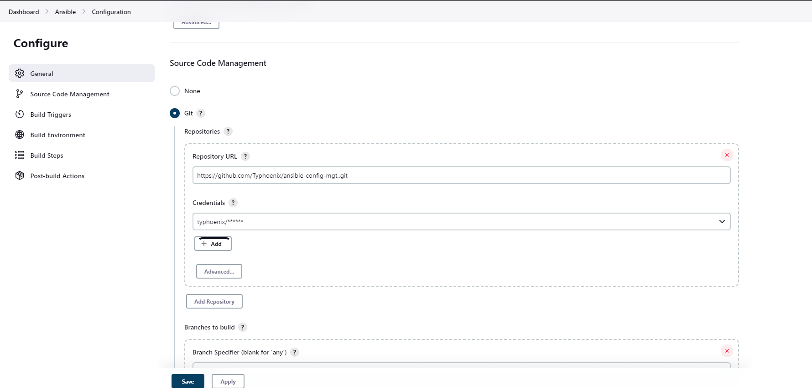
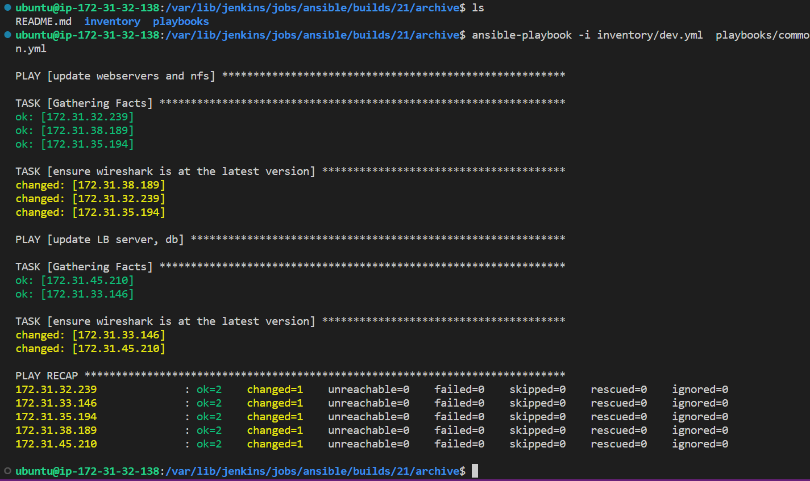
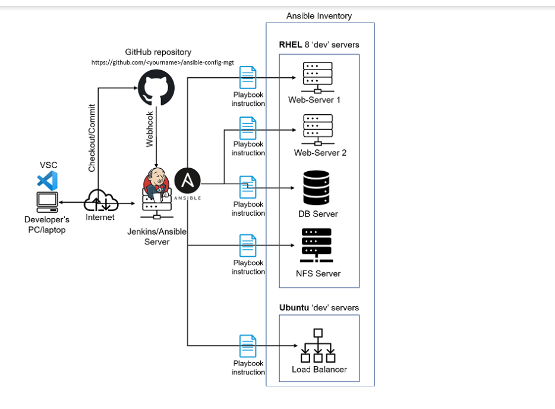

# Ansible Configuration Management - Automate Project 7 to 10

In Projects 7 to 10 we've had to perform a lot of manual operations - setting up virtual servers, installation and configuration of required software, deployment of  web application.

We're about to automate the routine tasks with a Configuration Management Tool called *Ansible*

### Task
1. Install and configure Ansible client to act as a Jump Server/Bastion Host
2. Create a simple Ansible playbook to automate servers configuration

## Ansible Client as a Jump Server (Bastion Host)

A Jump Server (also referred to as Bastion Host) is an intermediary server through which access to internal network can be provided. Ideally, the webservers would be inside a secured network which cannot be reached directly from the Internet. That means, even authorized persons cannot SSH into the Web servers directly and can only access it through a Bastion Host - it provide better security and reduces attack surface.

In the diagram below the Virtual Private Network (VPC) is divided into two subnets - Public subnet has public IP addresses and Private subnet is only reachable by private IP addresses.


### Install and configure Ansible on VM
- You can update the name tag on your Jenkins instance to *Jenkins-Ansible* if you like. As we'll also use this server to run ansible playbooks.
- Create a new repo on your GitHub and name it whatever is suitable (mine is ansible).
- Update Name tag on your Jenkins EC2 Instance to Jenkins-Ansible. We will use this server to run playbooks.

In your GitHub account create a new repository and name it ansible-config-mgt.

  

- Install Ansible

```
sudo apt update

sudo apt install ansible
```

Check your Ansible version by running 
`ansible --version`

```
Output:

ansible 2.9.6
  config file = /etc/ansible/ansible.cfg
  configured module search path = ['/home/ubuntu/.ansible/plugins/modules', '/usr/share/ansible/plugins/modules']
  ansible python module location = /usr/lib/python3/dist-packages/ansible
  executable location = /usr/bin/ansible
  python version = 3.8.10 (default, Nov 14 2022, 12:59:47) [GCC 9.4.0]

```

### Configure Jenkins build job to save your repository content every time you change it. 

- Create a new Freestyle project "ansible" in Jenkins and point it to your repository.
  




- Configure Webhook in GitHub and set webhook to trigger ansible build.
  

- Configure a Post-build job to save all (**) files.


- Manually trigger build to test configuration


- Test your setup by making some change in README.MD file in master branch and make sure that builds starts automatically and Jenkins saves the files (build artifacts) in following folder:

  
`ls /var/lib/jenkins/jobs/ansible/builds/<build_number>/archive/`

```
$ sudo ls /var/lib/jenkins/jobs/Ansible/builds/
1  2  3  legacyIds  permalinks

~$ sudo ls /var/lib/jenkins/jobs/Ansible/builds/2
archive  build.xml  changelog.xml  log  polling.log

$  sudo ls /var/lib/jenkins/jobs/Ansible/builds/2/archive/
README.md
```

Now our setup will look like this:


## Ansible Development
- In your  GitHub repository, create a new branch that will be used for development of a new feature (mine is ansible_integration)

- Checkout the newly created feature branch to your local machine to start building your code and directory structure
- Create a directory and name it *playbooks* - it will be used to store all your playbook files. Also Within the playbooks folder, create your first playbook, and name it *common.yml*
- Create a directory and name it *inventory* - it will be used to keep your hosts organised. Within the inventory folder, create an inventory file (use .ini format) for each environment (Development, Staging Testing and Production) dev, staging, uat, and prod respectively.
>Your file structure should look like this:


> Establish an ssh connection to each ip addresses grouped in the inventory file

### Set up an Ansible Inventory
An Ansible inventory file defines the hosts and groups of hosts upon which commands, modules, and tasks in a playbook operate. It is important to have a way to organize our hosts in such an Inventory.
- using SSH-Agent to upload our ssh public key to the jenkins-ansible server

```
eval `ssh-agent -s`
ssh-add <path-to-private-key>```
```
Confirm the key has been added with the command below, you should see the name of your key

`ssh-add -l`

```
Output:
$ ssh-add phoenix.pem
Identity added: phoenix.pem (phoenix.pem)
$ ssh-add -l
2048 SHA256:a8AGbwDAD7tfXY9FO2wJgqscToWCBNUkQC1xSW310w4 phoenix.pem (RSA)
```
- Persist the key on the jenkins-ansible server by running:
  
`ssh-add -l`

Now, ssh into your Jenkins-Ansible server using ssh-agent

`ssh -A ubuntu@public-ip`

Below inventory structure in the inventory/dev file to start configuring your development servers. *Ensure to replace the IP addresses according to your own setup*.

Update your inventory/dev.yml file with this snippet of code:

```
[nfs]
<NFS-Server-Private-IP-Address> ansible_ssh_user='ec2-user'

[webservers]
<Web-Server1-Private-IP-Address> ansible_ssh_user='ec2-user'
<Web-Server2-Private-IP-Address> ansible_ssh_user='ec2-user'

[db]
<Database-Private-IP-Address> ansible_ssh_user='ec2-user' 

[lb]
<Load-Balancer-Private-IP-Address> ansible_ssh_user='ubuntu'
```
### Create a Playbook
It is time to start giving Ansible the instructions on what you needs to be performed on all servers listed in inventory/dev.

Update your playbooks/common.yml file with following code:

```
---
- name: update webservers and nfs 
  hosts: webservers, nfs
  remote_user: ec2-user
  become: yes
  become_user: root
  tasks:
  - name: ensure wireshark is at the latest version
    yum:
      name: wireshark
      state: latest

- name: update LB server, db
  hosts: lb, db
  remote_user: ubuntu
  become: yes
  become_user: root
  tasks:
  - name: ensure wireshark is at the latest version
    apt:
      name: wireshark
      state: latest
```

This playbook is divided into two parts, each of them is intended to perform the same task: install wireshark utility (or make sure it is updated to the latest version) on your Centos8 and Ubuntu servers. It uses root user to perform this task and respective package manager: yum for RHEL 8 and apt for Ubuntu.
### Update GIT with the latest code

Now that we have a separate branch, we'll need to raise a Pull Request (PR), so as to get your branch peer merged to the master branch.

use git commands to add, commit and push your branch to GitHub.

```
git status

git add <selected files>

git commit -m "commit message"
```
- Create a Pull request (PR)
Wear a hat of another developer for a second, and act as a reviewer. If the reviewer is happy with your new feature development, merge the code to the master branch.


Head back on your terminal, checkout from the feature branch into the master, and pull down the latest changes using `git pull`.
Once your code changes appear in master branch - Jenkins will do its job and save all the files (build artifacts) to` /var/lib/jenkins/jobs/ansible/builds/<build_number>/archive/` directory on Jenkins-Ansible server.


Now run the follwing command to list out your inventory:

`$ ansible-inventory -i /var/lib/jenkins/jobs/ansible/builds/build_no/archive/inventory/dev.yml --list`

``

```
Output
{
    "_meta": {
        "hostvars": {
            "172.31.32.239": {
                "ansible_ssh_user": "ec2-user"
            },
            "172.31.33.146": {
                "ansible_ssh_user": "ubuntu"
            },
            "172.31.35.194": {
                "ansible_ssh_user": "ec2-user"
            },
            "172.31.38.189": {
                "ansible_ssh_user": "ec2-user"
            },
            "172.31.45.210": {
                "ansible_ssh_user": "ubuntu"
            }
        }
    },
    "all": {
        "children": [
            "db",
            "lb",
            "nfs",
            "ungrouped",
            "webservers"
        ]
    },
    "db": {
        "hosts": [
            "172.31.33.146"
        ]
    },
    "lb": {
        "hosts": [
            "172.31.45.210"
        ]
    },
    "nfs": {
        "hosts": [
            "172.31.35.194"
        ]
    },
    "webservers": {
        "hosts": [
            "172.31.32.239",
            "172.31.38.189"
        ]
    }
}
```
- Run a ping to test connection to all our remote hosts

`$ ansible all -i /var/lib/jenkins/jobs/ansible/builds/build_no/archive/inventory/dev.yml -m ping`
 
This would execute the ping module on all hosts listed in your custom inventory file.

```
Output
172.31.38.189 | SUCCESS => {
    "ansible_facts": {
        "discovered_interpreter_python": "/usr/libexec/platform-python"
    },
    "changed": false,
    "ping": "pong"
}
172.31.32.239 | SUCCESS => {
    "ansible_facts": {
        "discovered_interpreter_python": "/usr/libexec/platform-python"
    },
    "changed": false,
    "ping": "pong"
}
172.31.35.194 | SUCCESS => {
    "ansible_facts": {
        "discovered_interpreter_python": "/usr/libexec/platform-python"
    },
    "changed": false,
    "ping": "pong"
}
172.31.33.146 | SUCCESS => {
    "ansible_facts": {
        "discovered_interpreter_python": "/usr/bin/python3"
    },
    "changed": false,
    "ping": "pong"
}
172.31.45.210 | SUCCESS => {
    "ansible_facts": {
        "discovered_interpreter_python": "/usr/bin/python3"
    },
    "changed": false,
    "ping": "pong"
}
```
## Run first Ansible test
Now, it's time to execute ansible-playbook command and verify if your playbook actually works:

`ansible-playbook -i /var/lib/jenkins/jobs/ansible/builds/<build-number>/archive/inventory/dev.yml /var/lib/jenkins/jobs/ansible/builds/<build-number>/archive/playbooks/common.yml`



You can go to each of the servers and check if wireshark has been installed by running `which wireshark` or `wireshark --version`


Your updated with Ansible architecture now looks like this:



Congratulations
You have just automated your routine tasks by implementing your first Ansible project! 

